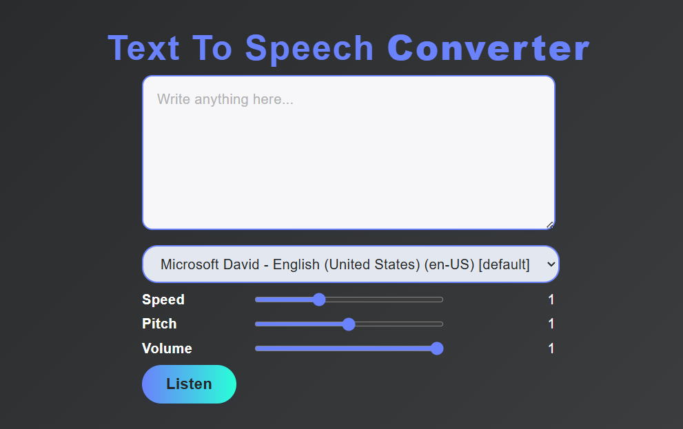

   
  
   

  <h1>🗣️ Narrato</h1>
  
Transform written text into natural-sounding speech, making content more accessible and interactive. Perfect for assistive tech, automated voice notifications, or experimenting with speech synthesis! 🚀

  

    
    
    
  

---

## ✨ Features

- 🔤 **Text Input**: Supports plain text input.
- 🎤 **Realistic Voice Output**: Converts text to clear, natural-sounding speech.
- 🌐 **Multi-Language Support**: Easily configurable for different languages and accents.
- ⚙️ **Customizable Settings**: Adjust speed, pitch, and volume.
- 🖥️ **User-Friendly Interface**: Simple and intuitive GUI (if applicable).

---

## 🚀 How to Use

1. Enter any text in the input area.
2. Configure voice settings if needed (speed, pitch, language).
3. Click "Speak" to hear the audio output.

---

## 📦 Tech Stack

- **HTML5** – Webpage structure
- **CSS3** – Responsive and elegant styling
- **JavaScript** – Implements text-to-speech functionality using Web Speech API or other libraries

